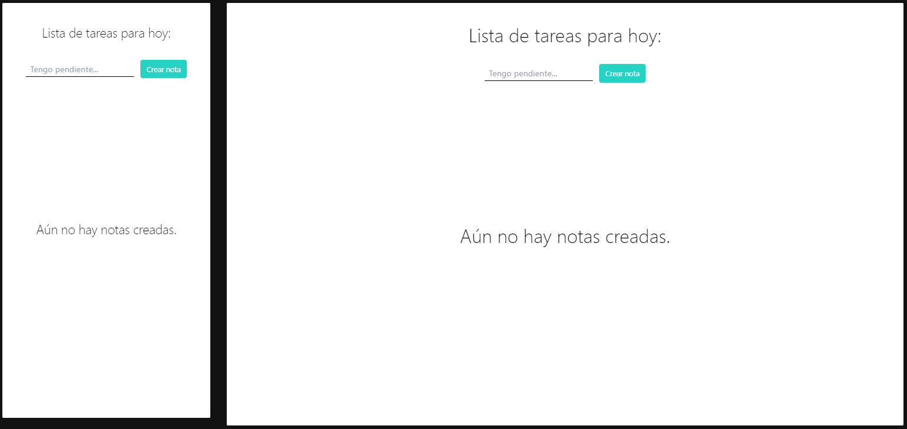
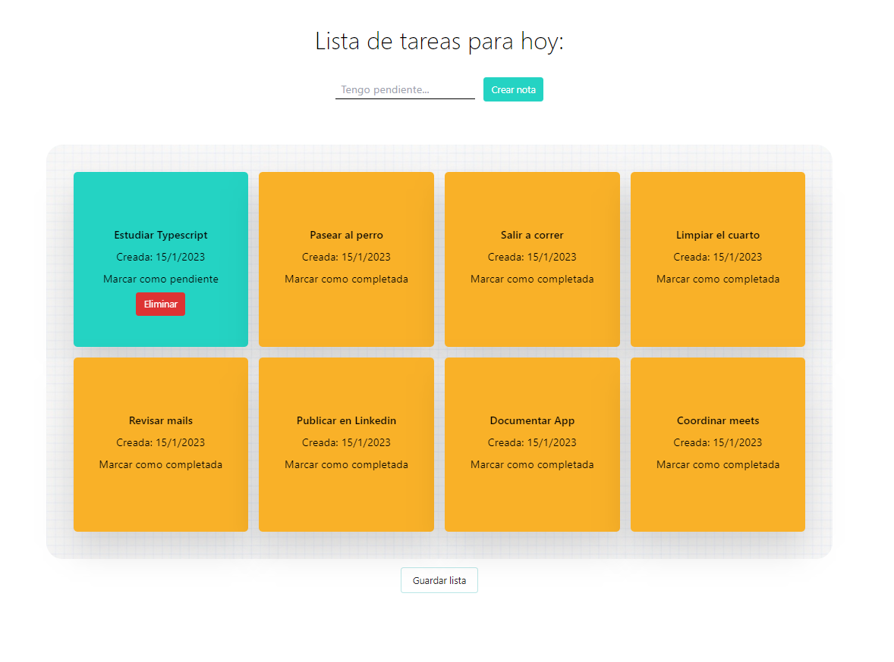

# ✅ To-do APP

## 💡 Descripción

Creador de notas pendientes desarrollado con Typescript. Es un proyecto de práctica del uso de Typescript con React JS.

📌 https://todo-app-with-typescript.netlify.app/

## Dependencias    
El desarrollo fue realizado con:
- Vite
- React
- Typescript
- Tailwind CSS
- SweetAlert2

Consiste en una interfaz que permite ver las tareas pendientes del dia y su estado actual. El usuario crea la tarjeta y al verla representada en el tablero puede manejar sus estados (completada o pendiente) y eliminar las que esten completadas. Se pueden ver más capturas de pantalla de la app funcionando desde la carpeta "screenshots".

<div align="center"></div>
<div align="center"></div>

## ✔️ Funcionalidad:

- Crear notas y agregarlas al tablero.
- Cambiar el estado de la nota
- Eliminar una nota si ya fue completada.
- Es posible "guardar las notas" para que la proxima vez que regrese al sitio se vean las que fueron guardadas previamente.
- Eliminar todas las notas guardadas para tener un tablero nuevo la proxima vez que ingrese al sitio.
- Si el usuario no guarda sus notas al salir del sitio o elimina las guardadas, al volver a ingresar encontrará su tablero vacio.
- Apto para celulares, tablets y pc de escritorio.

🧉 El objetivo de este desarrollo fue poner a prueba los conocimientos adquiridos durante el curso "Aprende Typescript desde cero", parte de mi proceso de aprendizaje de React con Typescript.

## 🚀 Ejecutar el proyecto:
```
npm install 
npm run dev
```
## Autor:
Francisco D. Molina <br>
[](https://github.com/TheFranciscoMolina) [](https://www.linkedin.com/in/franciscomolina-dev/)
